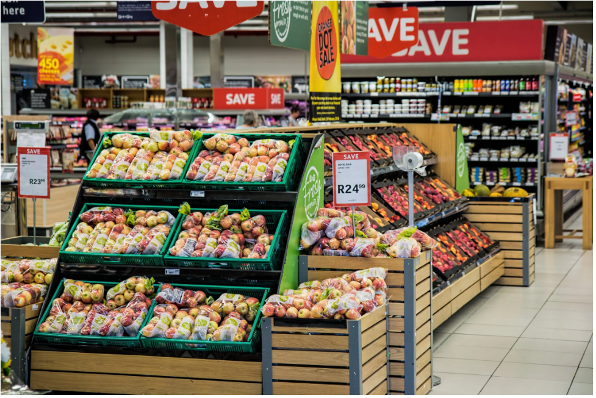
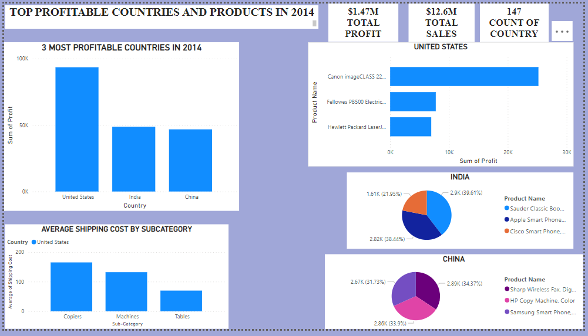
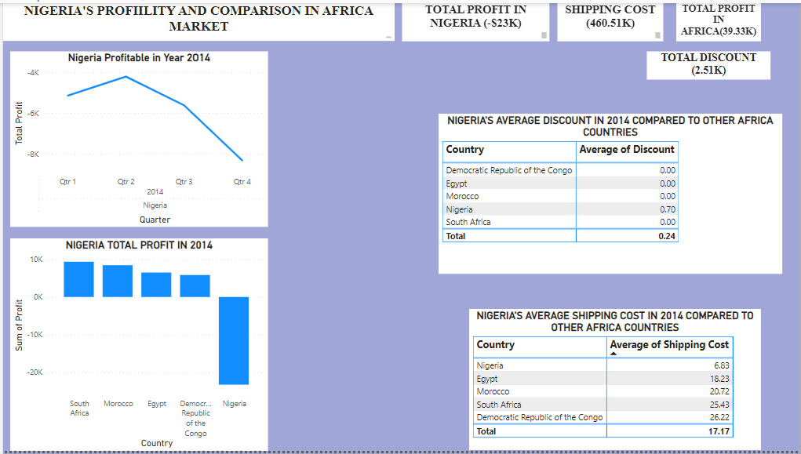
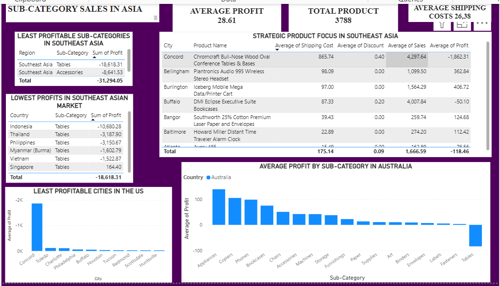
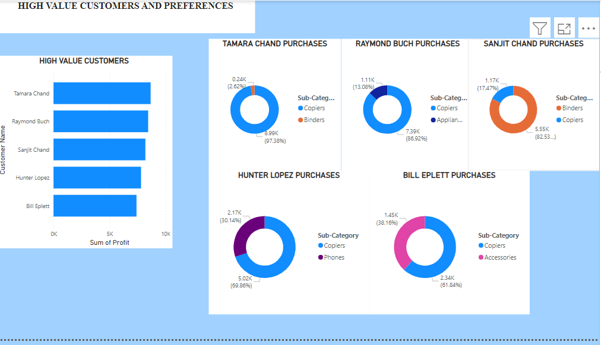

# Global-superstore-analysis 

## Introduction
This PowerBI project focuses on analyzing sales data from a hypothetical **Global Superstore** 
The project is to analyze and derive insights, enhance performance to answer crucial questions and help make data-driven decision.
**Disclaimer**: The datasets used are purely for demonstration purposes and do not represent any specific company, institution, or country.
## Problem Statement
1. Identify the top three countries generating the highest profits in 2014 along with their most profitable products.
2. Determine the three subcategories with the highest average shipping costs within the United States.
3. Evaluate Nigeria's 2014 profitability in comparison to other African countries, exploring factors affecting its performance.
4. Discover the least profitable product subcategory in Southeast Asia and consider discontinuing it in specific regional markets.
5. Analyze the least profitable city in the United States (excluding cities with less than 10 orders) and understand the reasons behind its low profitability.
6. Find the product subcategory yielding the highest average profit in Australia.
7. Identify top customers and understand their purchasing patterns.
## Skills Demonstrated
The following power Bi features are incorporated-
-DAX
-New Measures
-Page Navigation 
-Filters
-Tooltips
-Buttons
-Modeling
## Modelling
The dataset adopts a star schema, comprising three tables: orders, returns, and people. The Orders table serves as the primary transactional data while Returns and People tables offer supplementary information.
## Visualization
The report encompasses five pages:
1. Top-Performing Countries and Products
2. Nigeria's Profit Evaluation
3. Subcategories in Southeast Asia
4. High Value customer analysis

You can interact with the report [here](https://app.powerbi.com/links/nPcZ44wR68?ctid=de77f51d-cfea-4fc7-b51a-311a7821fd4a&pbi_source=linkShare)

Features:
-Navigate through the dashboard, to explore different sections.
## Analysis
### Top Profitable Countries and Products.
The top three countries driving profits in 2014 were the United States, India, and China, with the US contributing nearly half of the total profit.
### Nigeria Profit.

Nigeria exhibited low shipping costs compared to other African countries, but its high average discount rates led to diminished profitability.
### Subcategory Sales.

Indonesia faced significant losses in the "Tables" subcategory, suggesting a potential discontinuation in that market.
Concord, a city in the US, reported high sales volumes, yet substantial delivery costs and significant discounts impacted its overall profitability negatively.
### High Value Customers

The top five customers showcased diverse purchasing patterns and preferences for different product subcategories.
## Conclusions And Recommendations

The analysis provides crucial insights into sales performance, profitability, and customer behavior at Global Superstore. Factors like shipping costs, discounts, and product preferences significantly influence profitability.

### Recommendations:
- Review pricing strategies and shipping costs, especially in key markets like the US and Nigeria. Consider implementing region-specific pricing and optimizing shipping routes.
- Evaluate product profitability closely and consider discontinuing or modifying low-profit products, like the "Tables" subcategory in Indonesia.
- Focus on high-profit markets such as the US, India, and China for business expansion.
- Develop targeted marketing for high-value customers, offering personalized promotions based on their preferences.
- Leverage continuous data analysis for informed decision-making in product assortment, pricing, and marketing strategies.
- 
Implementing these recommendations will optimize operations, enhance profitability, and bolster Global Superstore's competitive edge in the retail landscape.

**THANK YOU!**
  

